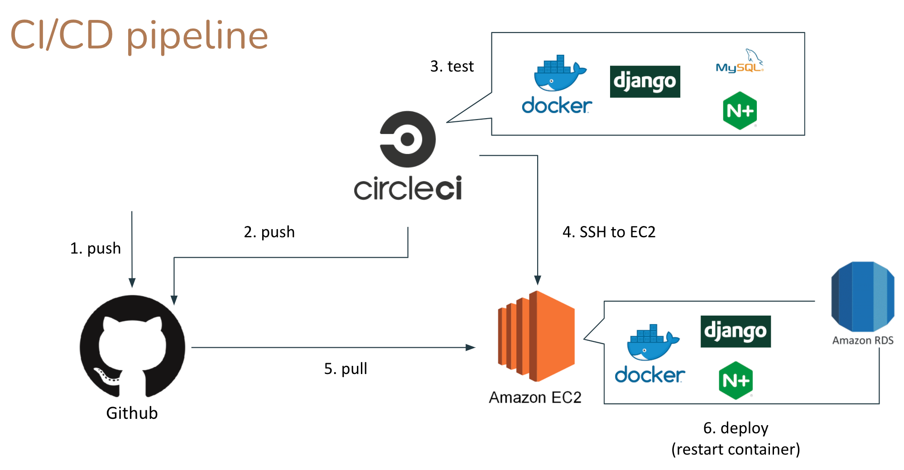

## Udagram Pipeline

### Continuous Integration

#### GitHub

The developers push and commit their code to a GitHub repository linked to the CircleCI platform.
When code is pushed to GitHub, the CircleCI platform is triggered , and if not error happen upload to s3 & eb

#### CircleCI

CircleCI reads the `.circleci/config.yml` file which tells the service what has to be done. In the case of Udagram,
there are 2 jobs (frontend & server) to be run by CircleCI.

- **Frontend**: Runs the `build` script given in the `package.json` file. Then uses AWS CLI to upload assets to S3.
- **Server**: Runs the `build` script, exports all environment variables from CircleCI configuration to a `.env` file,
  then runs the `archive` script. Then uses AWS CLI to upload archive to S3.